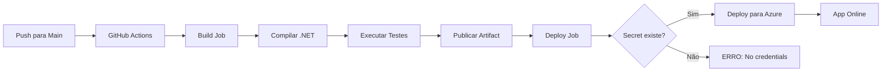

# ?? GUIA COMPLETO: Resolver Erro "No credentials found"

## ? Erro Atual

```
Error: Deployment Failed, Error: No credentials found. 
Add an Azure login action before this action.
```

## ? Solução Automatizada

### **PASSO 1: Execute o Script de Setup**

```powershell
# No PowerShell, execute:
.\setup-github-deploy.ps1
```

**O script vai:**
1. ? Verificar Azure CLI
2. ? Fazer login no Azure
3. ? Criar Resource Group (finansmart-rg)
4. ? Criar App Service Plan (finansmart-plan)
5. ? Criar Web App (finansmart-app)
6. ? Gerar arquivo `publish-profile.xml`
7. ? Mostrar instruções para GitHub

---

### **PASSO 2: Adicionar Secret ao GitHub**

#### **2.1 - Abrir o Arquivo Gerado**

```powershell
notepad publish-profile.xml
```

#### **2.2 - Copiar TODO o Conteúdo**

Pressione **Ctrl+A** (selecionar tudo) e depois **Ctrl+C** (copiar)

O arquivo deve se parecer com isso:

```xml
<?xml version="1.0" encoding="utf-8"?>
<publishData>
  <publishProfile 
    profileName="finansmart-app - Web Deploy" 
    publishMethod="MSDeploy" 
    publishUrl="finansmart-app.scm.azurewebsites.net:443" 
    msdeploySite="finansmart-app" 
    userName="$finansmart-app" 
    userPWD="ABC123XYZ789..." 
    destinationAppUrl="https://finansmart-app.azurewebsites.net" 
    ...>
  </publishProfile>
</publishData>
```

#### **2.3 - Acessar GitHub Secrets**

?? **Link direto**: https://github.com/Leandro-Solany/Finansmart/settings/secrets/actions

Ou manualmente:
1. Vá para seu repositório no GitHub
2. Clique em **Settings**
3. No menu esquerdo, clique em **Secrets and variables** ? **Actions**
4. Clique em **New repository secret**

#### **2.4 - Adicionar o Secret**

```
Name: AZURE_WEBAPP_PUBLISH_PROFILE

Value: [Cole o conteúdo XML completo aqui]
```

**?? IMPORTANTE:** Cole o XML COMPLETO, incluindo:
- A primeira linha `<?xml version="1.0"...`
- Todas as tags `<publishProfile>`
- A última linha `</publishData>`

#### **2.5 - Salvar**

Clique em **Add secret**

---

### **PASSO 3: Testar o Deploy**

#### **Opção A: Push para Main (Deploy Automático)**

```sh
git add .
git commit -m "chore: Configure Azure deployment credentials"
git push origin main
```

#### **Opção B: Merge Feature Branch**

```sh
git checkout main
git merge feature/config
git push origin main
```

#### **Opção C: Deploy Manual (GitHub Actions)**

1. Vá para: https://github.com/Leandro-Solany/Finansmart/actions
2. Selecione o workflow **"Build and Deploy to Azure App Service"**
3. Clique em **Run workflow**
4. Selecione a branch **main**
5. Clique em **Run workflow**

---

## ?? Verificar Deploy

### **1. GitHub Actions**

?? https://github.com/Leandro-Solany/Finansmart/actions

Você verá:
- ? Build job (compilação e testes)
- ? Deploy job (upload para Azure)

### **2. Azure Portal**

?? https://portal.azure.com

1. Vá para **App Services**
2. Clique em **finansmart-app**
3. No menu esquerdo, clique em **Deployment Center**
4. Veja os logs de deployment

### **3. Aplicação Funcionando**

- **App**: https://finansmart-app.azurewebsites.net
- **Swagger**: https://finansmart-app.azurewebsites.net/swagger

---

## ?? Segurança - IMPORTANTE

### ? O Que ESTÁ Protegido

- ? `publish-profile.xml` está no `.gitignore`
- ? Secret está seguro no GitHub (criptografado)
- ? Não aparece nos logs do workflow

### ? O Que NÃO Fazer

- ? **NUNCA** commite `publish-profile.xml`
- ? **NUNCA** copie/cole o secret em issues/PRs
- ? **NUNCA** compartilhe em Discord/Slack

---

## ?? Checklist Final

- [ ] Script `setup-github-deploy.ps1` executado
- [ ] Arquivo `publish-profile.xml` gerado
- [ ] Secret adicionado ao GitHub
- [ ] Push/merge para branch `main`
- [ ] Workflow executado com sucesso
- [ ] App acessível em https://finansmart-app.azurewebsites.net

---

## ?? Troubleshooting

### ? Erro: "Azure CLI not found"

```powershell
# Instalar Azure CLI
winget install -e --id Microsoft.AzureCLI

# Ou baixar em:
# https://aka.ms/installazurecliwindows
```

### ? Erro: "Secret not found"

**Causa:** Nome do secret está errado

**Solução:** Certifique-se que o nome é **exatamente**:
```
AZURE_WEBAPP_PUBLISH_PROFILE
```

### ? Erro: "Invalid publish profile"

**Causa:** XML incompleto ou corrompido

**Solução:** 
1. Delete o secret atual no GitHub
2. Execute `.\setup-github-deploy.ps1` novamente
3. Copie o XML completo (incluindo primeira e última linha)
4. Adicione novamente

### ? Erro: "Resource 'finansmart-app' not found"

**Causa:** Nome do app diferente no workflow

**Solução:** Verifique se o nome no workflow é `finansmart-app`

---

## ?? Arquivos Criados

- ? `setup-github-deploy.ps1` - Script de automação
- ? `publish-profile.xml` - Gerado pelo script (NÃO COMMITAR!)

---

## ?? Entendendo o Fluxo



---

## ? Resultado Final

Após seguir todos os passos:

```
? Build: Success
? Tests: 66/66 Passed
? Deploy: Success
? App: Online
?? URL: https://finansmart-app.azurewebsites.net
?? Swagger: https://finansmart-app.azurewebsites.net/swagger
```

---

**?? Execute agora: `.\setup-github-deploy.ps1`**

---

**Criado em**: ${new Date().toLocaleString()}  
**Branch**: feature/config ? main  
**Status**: ? Pronto para executar
